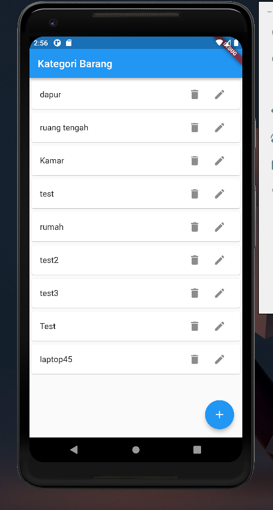
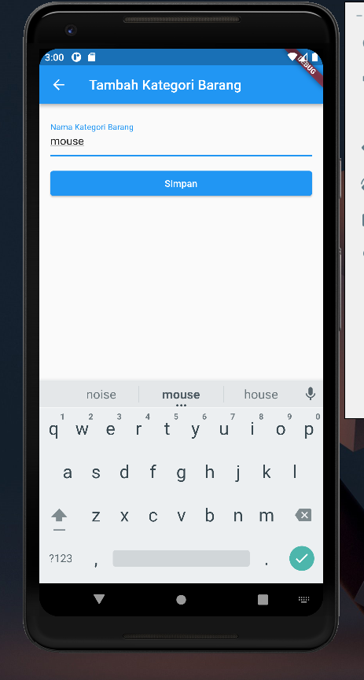
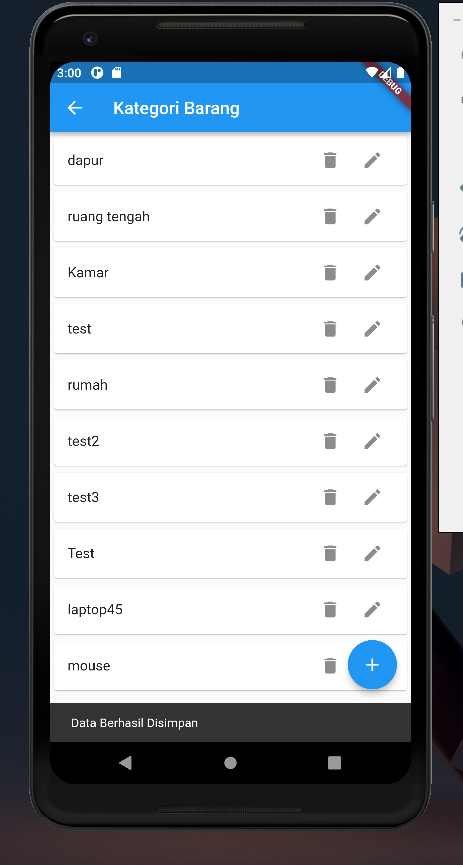
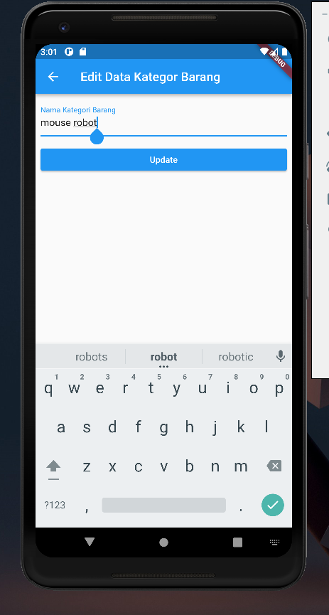
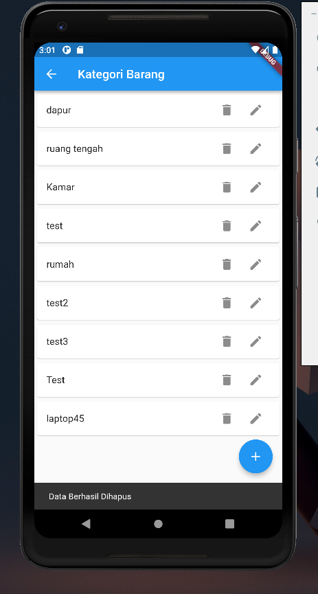

# Hasil Running REST-API Flutter

## Get Data Kategori Barang

## Post Data kategori Barang

## Result Post Data Kategori Barang

## Edit Data Kategori Barang

## Result Edit Data Kategori Barang

## Delete Data Kategori Barang

